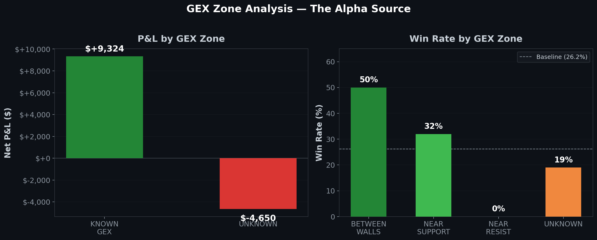

# MAD DOG Terminal

**A real-time options trading terminal built on Interactive Brokers, designed for gamma squeeze plays with institutional-grade risk controls.**

> ⚠️ **This repository contains documentation only.** Source code is private — this is a live trading system with proprietary signal logic.

---

## What This Is

MAD DOG is a FastAPI + ib_insync trading terminal I built to execute a specific options strategy: identify institutional flow via [Unusual Whales](https://unusualwhales.com/) (large sweeps, AGG* signals), use GEX (Gamma Exposure) walls as entry triggers and stop-loss/take-profit levels, and manage positions through IBKR with automated risk controls.

The system is **semi-autonomous by design** — signal generation, GEX zone classification, and risk management are automated; execution requires manual confirmation. This is intentional: for a strategy that trades ~65 times over a backtest period with 26% win rate, human oversight on entry timing is worth more than full automation.

**Live trading on Interactive Brokers with real capital.**

---

## System Architecture

```
Unusual Whales Scanner
    │  (manual: identify sweeps, AGG* signals)
    │
    ▼
┌──────────────────────────────────────────────┐
│              MAD DOG Terminal                 │
│                                              │
│  ┌─────────────┐    ┌─────────────────────┐  │
│  │ Signal       │    │ GEX Wall Observer   │  │
│  │ Validation   │    │                     │  │
│  │              │    │ • Zone classifier   │  │
│  │ • Chain B/A  │    │   (BETWEEN_WALLS,   │  │
│  │   ≥ 95%     │    │    NEAR_SUPPORT,     │  │
│  │ • Premium    │    │    NEAR_RESIST,      │  │
│  │   ≥ $50K    │    │    UNKNOWN)          │  │
│  │ • OI > 0    │    │ • Daily log          │  │
│  │ • Next-day  │    │ • T+4 outcome        │  │
│  │   OI confirm│    │   backfill           │  │
│  └──────┬──────┘    │ • Zone win-rate      │  │
│         │           │   statistics         │  │
│         ▼           └──────────┬───────────┘  │
│  ┌─────────────┐              │              │
│  │ Entry/Exit  │◄─────────────┘              │
│  │ Engine      │                             │
│  │             │    ┌─────────────────────┐   │
│  │ • Limit     │    │ Risk Management     │   │
│  │   price     │    │                     │   │
│  │   calc      │    │ • Daily loss kill   │   │
│  │ • Spin loop │    │   switch ($300)     │   │
│  │   timeouts  │    │ • T-5 DTE time stop │   │
│  │ • SL/TP     │    │ • Per-position      │   │
│  │   placement │    │   FLATTEN button    │   │
│  └──────┬──────┘    │ • IB disconnect     │   │
│         │           │   handler           │   │
│         ▼           └─────────────────────┘   │
│  ┌─────────────┐                             │
│  │ IBKR via    │                             │
│  │ ib_insync   │                             │
│  │             │                             │
│  │ • Real-time │                             │
│  │   tick sub  │                             │
│  │ • Order     │                             │
│  │   management│                             │
│  │ • Portfolio │                             │
│  │   dashboard │                             │
│  └─────────────┘                             │
│                                              │
│  FastAPI REST endpoints + Web UI             │
└──────────────────────────────────────────────┘
```

---

## Features

### Trading Execution
- **IBKR integration** via `ib_insync` — real-time tick subscription, order submission, portfolio tracking
- **Limit price correction** — auto-adjusts entry prices based on live bid/ask spread
- **Entry/exit spin loop with timeouts** — prevents infinite waits on unfilled orders
- **Hot-update for filled agents** — running agents adapt when partial fills occur without restart
- **Manual FLATTEN button** — per-position emergency exit via `/flatten_position/{con_id}` endpoint

### GEX Wall Analysis
- **Zone classifier** — categorizes current price relative to GEX walls: `BETWEEN_WALLS`, `NEAR_SUPPORT`, `NEAR_RESIST`, `UNKNOWN`
- **Python CLI tool** (`gex_log.py`) with 4 modes:
  - `log` — record daily GEX wall observations
  - `outcome` — backfill T+4 trade outcomes
  - `summary` — aggregate zone win-rate statistics
  - `show` — display observation history
- **Trading rules derived from data**: skip `NEAR_RESIST` (0 TP hits, 67% SL rate) and `UNKNOWN` zones entirely

### Risk Management
- **Daily loss kill switch** — halts all new entries when cumulative daily loss exceeds threshold (default $300, configurable via env var)
- **T-5 DTE time stop** — auto-exits positions approaching expiration
- **IB disconnect handler** — graceful behavior on connection drops
- **Idempotent tick subscription** — prevents duplicate data feeds on reconnect
- **SL/TP offset logic** — avoids round-number levels where market makers cluster

### Signal Quality Filters
- Chain Bid/Ask spread ≥ 95%
- Premium ≥ $50K
- Open Interest > 0 (confirmed next day)
- GEX zone must be `BETWEEN_WALLS` or `NEAR_SUPPORT`

---

## Strategy Framework

**Barbell portfolio construction:**
- ~90% in laddered U.S. Treasuries / cash equivalents
- ~10% risk allocation for gamma squeeze options plays

**Signal source:** Unusual Whales (Basic plan) — institutional sweeps and AGG* flow signals

**Entry logic:** UW flow signal → GEX zone validation → limit order at corrected price

**Exit logic:** SL/TP at GEX wall levels (with offset) OR T-5 DTE time stop OR daily loss kill switch OR manual FLATTEN

---

## Backtest Results (Databento OPRA.PILLAR)

Backtested against real tick-level data from Databento's OPRA.PILLAR dataset (~$3.25 for 79-signal backtest).

### Phase 2: Raw Results (All Zones, No Filtering)

| Metric | Value |
|--------|-------|
| Total trades | 65 |
| Notional | $10,000 |
| Net P&L | +$4,674 |
| Profit Factor | 1.27 |
| Win Rate | 26.2% |

### GEX Zone Breakdown — Where the Alpha Lives

| Zone | Trades | Win Rate | P&L |
|------|--------|----------|-----|
| **KNOWN GEX** | 38 | 32% | +$9,324 |
| UNKNOWN | 27 | 19% | -$4,650 |
| BETWEEN_WALLS | (best) | 50% | — |
| NEAR_RESIST | (worst) | 0% TP | 67% SL |

**Key finding:** KNOWN GEX trades outperform UNKNOWN by ~$14K on 65 trades. `NEAR_RESIST` has zero take-profit hits. These two zones are pure negative EV — skipping them is the single largest edge.

### Phase 3: Filtered Results (Zone Rules + Scenario Analysis)

After applying the derived trading rules (skip `NEAR_RESIST` and `UNKNOWN`), performance improves dramatically across all TP/SL scenarios:

| Scenario | Trades | Win Rate | Total P&L | Profit Factor | $/Trade |
|----------|--------|----------|-----------|---------------|---------|
| ScenE_TP100 | 29 | 41.4% | $1,696 | 1.36 | $58 |
| NoTP_T30_G30 | 29 | 41.4% | $10,495 | 3.22 | $362 |
| NoTP_T30_G20 | 29 | 51.7% | $7,818 | 2.66 | $270 |
| NoTP_T50_G30 | 29 | 48.3% | $12,291 | 3.41 | $424 |
| NoTP_T50_G40 | 29 | 44.8% | $11,675 | 3.29 | $403 |
| TP200_T30_G30 | 29 | 41.4% | $5,324 | 2.13 | $184 |
| TP300_T50_G25 | 29 | 48.3% | $9,377 | 2.84 | $323 |

*Scenario naming: `NoTP` = let winners run (no take-profit cap), `T30/T50` = time stop at 30/50% DTE remaining, `G20/G30/G40` = GEX wall proximity threshold for SL.*

**Result:** GEX zone filtering transforms the strategy from PF 1.27 → PF 2.6–3.4 depending on exit configuration. The best scenario (`NoTP_T50_G30`) yields PF 3.41 with 48.3% win rate and $424/trade.

### Position Sizing

Live execution uses **half-Kelly sizing** to balance growth rate against drawdown risk. The Kelly fraction is derived from the filtered zone's win rate and payoff ratio — half-Kelly sacrifices ~25% of theoretical growth for ~50% reduction in variance.

---

## Test Suite

33 stdlib-only unit tests (`test_mad_dog.py`) covering:
- Entry/exit spin loop timeout behavior
- Limit price correction logic
- Reconciliation key uniqueness
- Kill switch trigger conditions
- Tick subscription idempotency
- Hot-update guards for filled agents

```bash
python -m pytest test_mad_dog.py -v
# 33 passed
```

---

## SOP (Standard Operating Procedure) — v4

The system runs under a written SOP document (v4) that codifies:

1. **Pre-market checklist** — verify IBKR connection, check daily loss counter reset, review UW scanner
2. **Signal evaluation workflow** — UW flow → quality filter → GEX zone check → entry decision
3. **Position management rules** — SL/TP placement, time stop monitoring, kill switch awareness
4. **GEX wall observation workflow** — daily log entry, T+4 outcome backfill, weekly zone stats review
5. **Post-market reconciliation** — compare executed trades vs intended signals, log discrepancies

---

## Tech Stack

| Component | Technology |
|-----------|-----------|
| Backend | FastAPI, Python 3.10+ |
| Broker API | `ib_insync` (Interactive Brokers TWS/Gateway) |
| Options Data | Databento OPRA.PILLAR (backtest), IBKR real-time (live) |
| Flow Scanner | Unusual Whales (Basic plan) |
| GEX Analysis | Custom Python CLI |
| Testing | stdlib `unittest`, 33 tests |
| Configuration | Environment variables (port, clientId, kill switch threshold) |

---

## Why Not Open Source

This is a live trading system with real capital. The entry/exit logic, GEX zone rules, and signal filtering parameters represent a tested edge. Open-sourcing would eliminate that edge.

The architecture, risk management design, and backtest methodology are fully documented here. The backtest results are reproducible with a Databento account (~$3.25 for the dataset).

---

## Related

- [**Options Backtest & GEX Analysis**](https://github.com/HaodongYan111/options-backtest-gex) — The quantitative research that produced the trading rules used in MAD DOG
- [**FinTel**](https://github.com/HaodongYan111/fintel) — Multi-agent financial intelligence platform (ESG + macro research)
